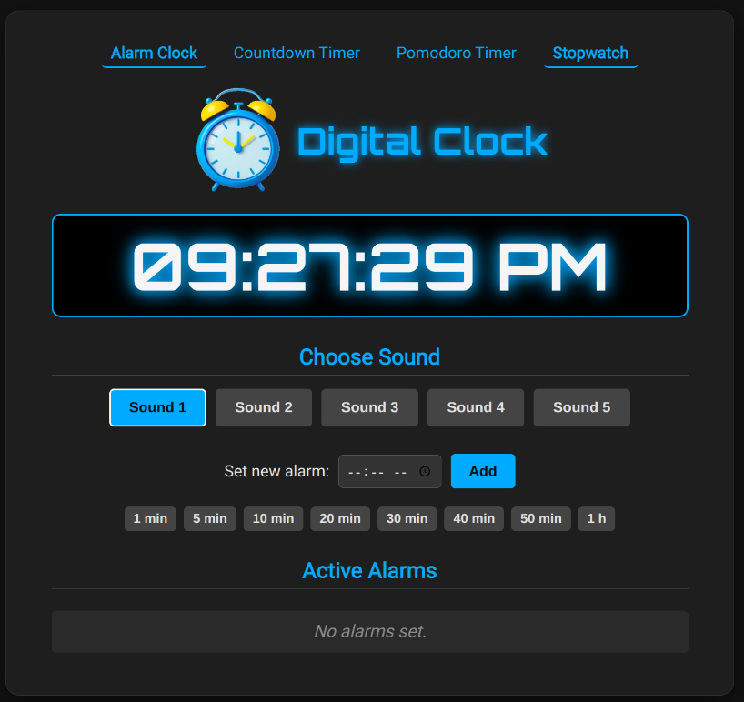
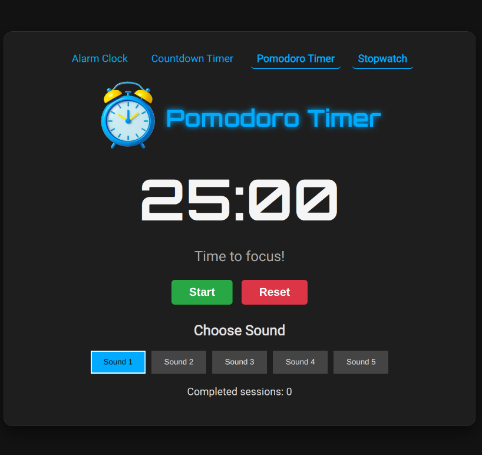
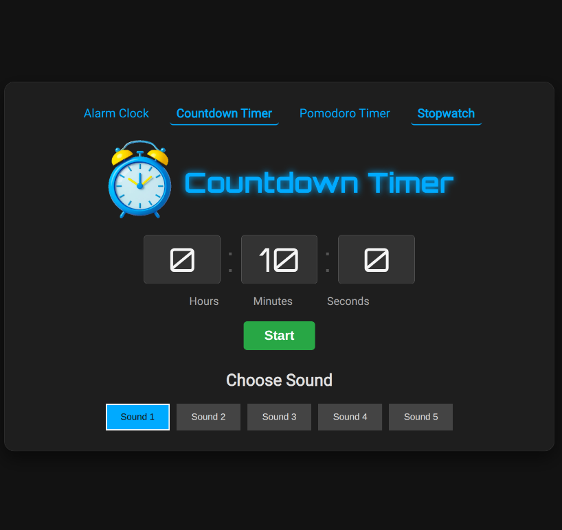
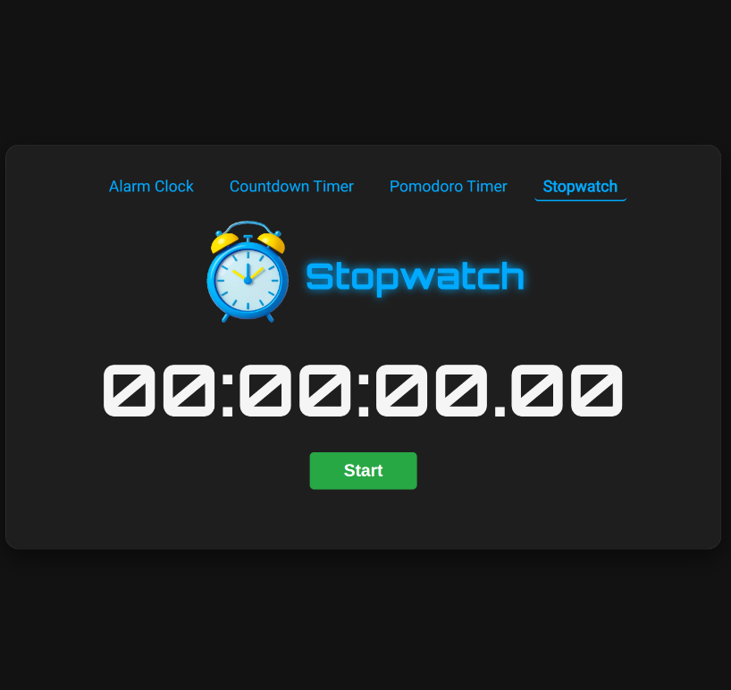

# Digital Clock, Pomodoro & Countdown Timer in Go

This is a multi-functional web application that provides a digital alarm clock, a Pomodoro timer, and a countdown timer. The backend is built in Go (Golang) to serve the pages and handle logic, while the frontend uses HTML, CSS, and JavaScript to create a dynamic and interactive user interface.

<table>
    <tr>
        <td>
            
        </td>
        <td>
            
        </td>
    </tr>
    <tr>
        <td>
            
        </td>
        <td>
            
        </td>
    </tr>
</table>

## Features

* **Multi-Page Navigation**: Easily switch between the Alarm Clock, Pomodoro Timer, and Countdown Timer.
* **Alarm Clock**:
  * Displays the current time in 12-hour format (AM/PM), updated every second.
  * Allows users to set multiple alarms.
  * Quick-set buttons for alarms 1 to 60 minutes from now.
  * Users can choose from 4 different alarm sounds.
  * A "Stop Alarm" button appears when an alarm is triggered.
  * The alarm list is automatically sorted to show the next alarm first.
  * Triggered alarms are marked in red and struck through for clarity.
* **Pomodoro Timer**:
  * A classic Pomodoro timer with 25-minute focus sessions and 5-minute short breaks.
  * Tracks completed sessions and provides a 15-minute long break after every four sessions.
  * Start, Pause, and Reset controls.
* **Countdown Timer**:
  * Set a custom countdown from hours, minutes, and seconds.
  * The same selection of 4 alarm sounds is available.
  * Start, Pause, and Reset controls.
* **Server-side Logging**: The Go backend logs all incoming requests for easy debugging and monitoring.

## Project Structure

```

/web-clock-app/
|
|-- main.go                \# Go backend server
|
|-- /templates/
|   |-- index.html         \# Alarm Clock page
|   |-- pomodoro.html      \# Pomodoro Timer page
|   |-- countdown.html     \# Countdown Timer page
|
|-- /static/
|-- /css/
|   |-- style.css      \# Styles for Alarm Clock
|   |-- pomodoro.css   \# Styles for Pomodoro Timer
|   |-- countdown.css  \# Styles for Countdown Timer
|
|-- /js/
|   |-- script.js      \# Logic for Alarm Clock
|   |-- pomodoro.js    \# Logic for Pomodoro Timer
|   |-- countdown.js   \# Logic for Countdown Timer
|
|-- /audio/
|   |-- alarm\_1.mp3    \# Audio files for the alarms
|   |-- alarm\_2.mp3
|   |-- alarm\_3.mp3
|   |-- alarm\_4.mp3
|
|-- /images/
|-- alarm-clock-icon.png \# Icon displayed in the title
|-- favicon.ico          \# Icon for the browser tab

````

## How to Run

### Prerequisites

* You need to have [Go](https://golang.org/dl/) installed on your system.

### Steps

1. **Clone or download the files** to a directory on your computer.
2. **Organize the files** according to the project structure described above. Make sure all audio and image files are in their correct folders.
3. **Open your terminal** and navigate to the project's root directory.
4. **Run the server** with the following command:
   ```bash
   go run main.go
````

5.  **Access the application**: Open your browser and go to `http://localhost:8080`. You can navigate to the other pages using the links at the top or by visiting `http://localhost:8080/pomodoro` and `http://localhost:8080/countdown`.

### Build

To create a standalone executable:

**Linux**

```bash
GOOS=linux GOARCH=amd64 go build -o clock-app.bin main.go
```

**Windows**

```bash
GOOS=windows GOARCH=amd64 go build -o clock-app.exe main.go
```

## Technologies Used

  * **Backend**: Go (using the `net/http`, `html/template`, `log`, `sync`, and `time` packages)
  * **Frontend**: HTML5, CSS3, JavaScript (ES6)

## 📜 License

This project is distributed under the MIT License. See the `LICENSE` file for more details.
