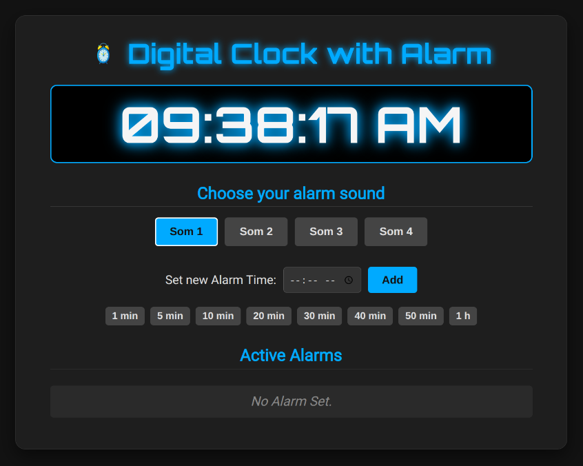

# Digital Clock with Alarm in Go and JavaScript

This is a web application project that displays a functional digital clock with an alarm system. The backend is built in Go (Golang) to serve the page and register alarms, while the frontend uses HTML, CSS, and JavaScript to create a dynamic and interactive user interface.



## Features

* **Real-time Clock**: Displays the current time in 12-hour format (AM/PM), updated every second.
* **Alarm Registration**: Allows the user to set multiple alarms for specific times.
* **Preset Alarms**: Quick access buttons to set an alarm for 1, 5, 10, 20, 30, 40, 50 minutes, or 1 hour from now.
* **Sound Selection**: The user can choose from 4 different alarm sounds.
* **Alarm Control**: A "Stop Alarm" button appears when an alarm is triggered.
* **Smart Alarm List**:
    * Alarms are automatically sorted in the list to show the next one to ring at the top.
    * Alarms that have already triggered today are marked in red and struck through for easy identification.
* **Modern Interface**: Dark, stylized layout with an icon next to the title.
* **Server-side Logging**: The Go backend logs all incoming requests, making debugging and monitoring easier.

## Project Structure

```

/relogio-alarme/
|
|-- main.go                \# Go backend server
|
|-- /templates/
|   |-- index.html         \# Main web page structure
|
|-- /static/
|-- /css/
|   |-- style.css      \# Stylesheet for the page's appearance
|
|-- /js/
|   |-- script.js      \# Frontend logic (clock, alarms, interactions)
|
|-- /audio/
|   |-- alarm\_1.mp3    \# Audio files for the alarms
|   |-- alarm\_2.mp3
|   |-- alarm\_3.mp3
|   |-- alarm\_4.mp3
|
|-- /images/
|-- alarm-clock-icon.png \# Icon displayed in the title

````

## How to Run

### Prerequisites

* You need to have [Go](https://golang.org/dl/) installed on your system.

### Steps

1.  **Clone or download the files** to a directory on your computer.
2.  **Organize the files** according to the project structure described above. Make sure the 4 `.mp3` audio files and the `.png` image file are in the correct folders (`/static/audio/` and `/static/images/`).
3.  **Open your terminal** and navigate to the project's root directory (`relogio-alarme`).
4.  **Run the server** with the following command:
    ```bash
    go run main.go
    ```
5.  **Access the application**: Open your browser and go to `http://localhost:8080`.

## Technologies Used

* **Backend**: Go (using the `net/http`, `html/template`, `log`, `sync`, and `time` packages)
* **Frontend**: HTML5, CSS3, JavaScript (ES6)
